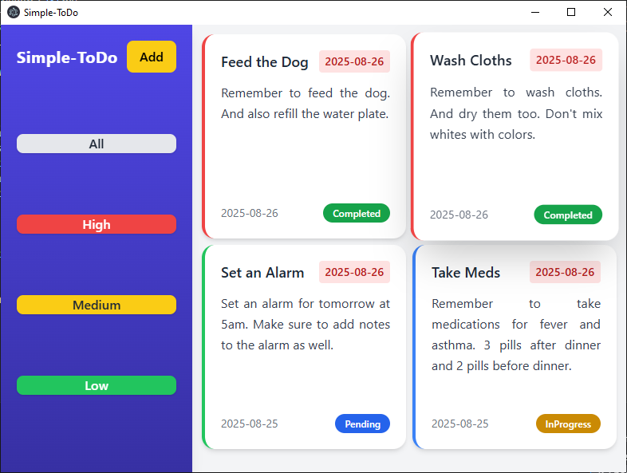
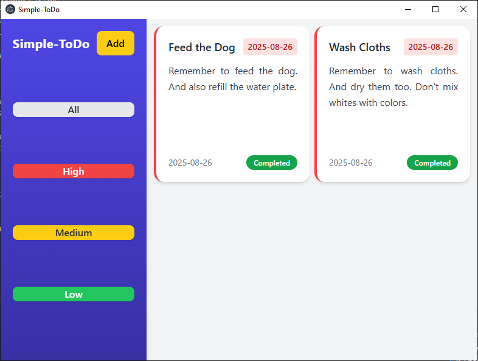
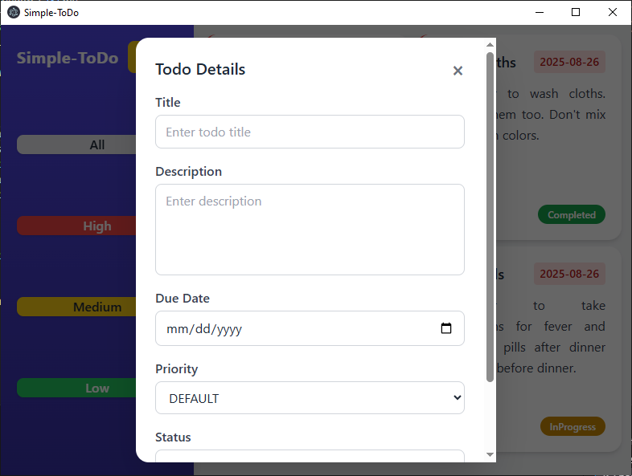
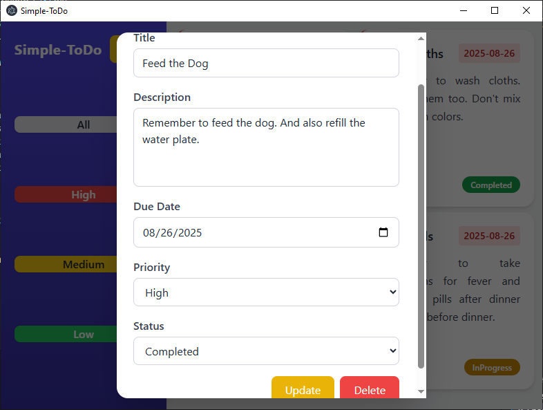

# Simple-Todo

A cross-platform To-Do application built with Electron.js for the frontend and ASP.NET Web API for the backend. The project demonstrates CRUD operations, clean API design, and desktop app integration.

## Key Features

- Frontend: Electron.js desktop app, offering a smooth, native-like experience across Windows, macOS, and Linux.

- Backend: ASP.NET Core Web API, delivering a RESTful foundation for CRUD (Create, Read, Update, Delete) operations on To-Do items.

- Project Structure: Clear separation between frontend (Electron app) and backend (Web API).

- Flexibility: Easily expandable to include authentication, user-specific features, etc.

## Prerequisites

- [.NET SDK](https://dotnet.microsoft.com/download) for the backend.
- [Node.js](https://nodejs.org) for the frontend.
- [SQL Server](https://www.microsoft.com/en-us/sql-server) for the batabase.

## Getting Started

### Frontend

1. Move to the directory

```bash
cd frontend
```

2. NPM install

```bash
npm install
```

3. Start the project

```bash
npm run start
```

### Backend

1. Make sure **SQL Server** is running and your connection string in `appsettings.json` is correct.
2. Run migrations (if needed):

```bash
cd backend
dotnet ef database update
```

3. Start the web api

```bash
dotnet run
```

# Screenshots

1. Dashboard
   
2. Filtered View
   
3. New Todo
   
4. Update Todo
   

# Goals

- To understand ASP.net web api project structure.
- To understand how Electron.js.
